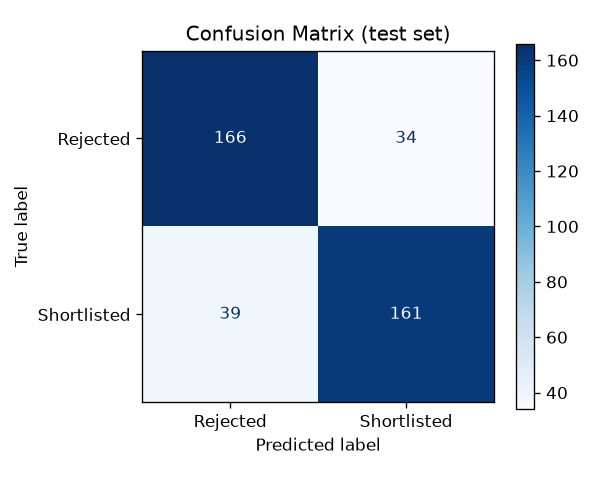
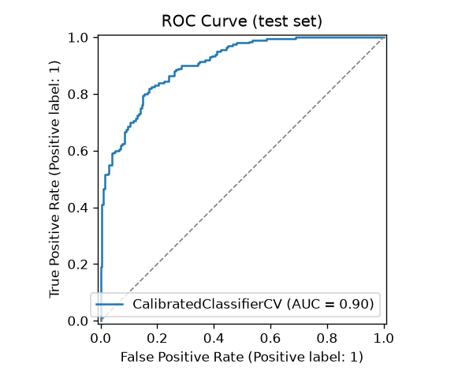
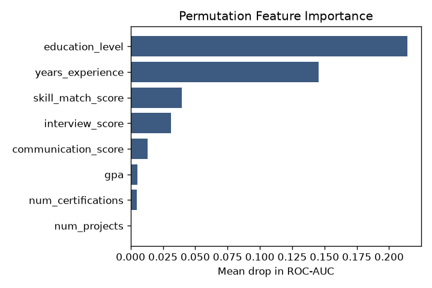
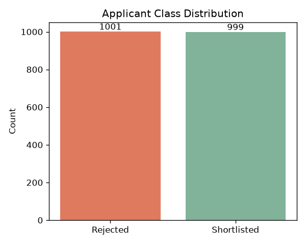
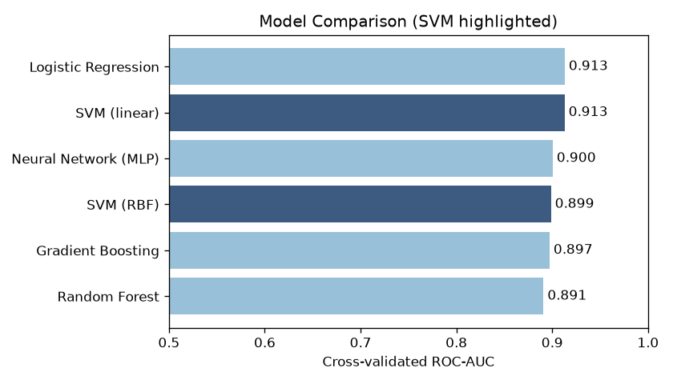
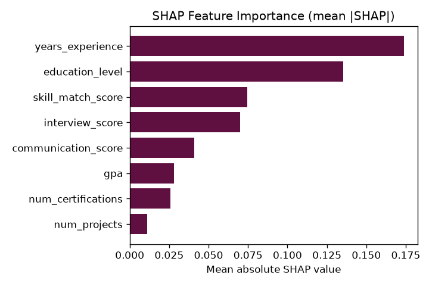
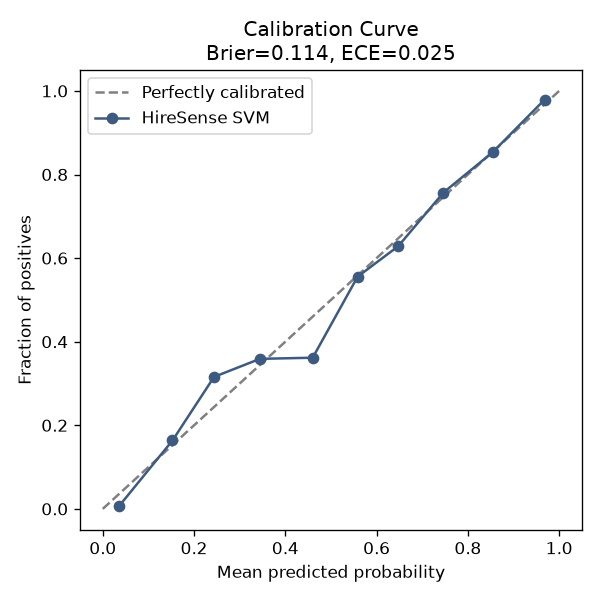

# HireSense AI 🧠💼

**A job applicant screening system built with a Support Vector Machine (SVM).**

HireSense AI is a machine-learning system that automatically screens job
applicants. It analyses a candidate's experience, education, skills, interview
scores and more, then predicts whether the candidate should be **shortlisted**
or **rejected**.

---

## 🎯 Overview

| Item | Details |
|------|---------|
| **Project Name** | HireSense AI |
| **Problem Solved** | Job Applicant Screening |
| **ML Algorithm** | Support Vector Machine (SVM) |
| **Type** | Binary Classification (Shortlist / Reject) |

**Why SVM?** Applicant features are numeric and the boundary between classes
can be non-linear. Through the kernel trick, an SVM learns such boundaries well
and is efficient on small-to-medium datasets.

---

## 📊 Features

The model uses the following eight attributes of each applicant:

| Feature | Meaning | Range |
|---------|---------|-------|
| `years_experience` | Relevant work experience (years) | 0–25 |
| `education_level` | Education level (0=HS, 1=Bachelor, 2=Master, 3=PhD) | 0–3 |
| `skill_match_score` | How well skills match the job requirements | 0–100 |
| `interview_score` | Interview performance | 0–100 |
| `communication_score` | Communication skills | 0–100 |
| `num_certifications` | Number of relevant certifications | 0–10 |
| `num_projects` | Number of completed projects | 0–20 |
| `gpa` | Grade point average | 2.0–4.0 |

**Target:** `shortlisted` → `1` (shortlist) or `0` (reject)

The dataset also carries a `group` column — a synthetic protected attribute
used **only** by the fairness audit. It is never a model feature.

---

## 🗂️ Project Structure

```
HireSense-AI/
├── src/
│   ├── config.py          # feature schema, paths, constants
│   ├── generate_data.py   # synthetic applicant dataset generator
│   ├── train.py           # SVM training, tuning, versioning + logging
│   ├── predict.py         # screen / rank applicants (threshold + profiles)
│   ├── explain.py         # global + per-applicant explanations
│   ├── visualize.py       # evaluation plots (PNG)
│   ├── compare_models.py  # SVM vs other classifiers
│   ├── fairness.py        # bias / fairness audit
│   ├── bias_mitigation.py # group-specific thresholds to reduce bias
│   ├── job_profiles.py    # per-role screening profiles
│   ├── resume_parser.py   # extract features from text resumes
│   ├── report.py          # per-applicant PDF report
│   ├── tune_optuna.py     # Bayesian hyperparameter tuning
│   ├── shap_explain.py    # SHAP explanations
│   ├── conformal.py       # conformal prediction (uncertainty)
│   ├── threshold.py       # optimal decision threshold
│   ├── diagnostics.py     # calibration curve
│   ├── drift.py           # data drift detection
│   ├── validation.py      # input data validation
│   ├── registry.py        # versioned model registry
│   ├── model_card.py      # responsible-AI model card
│   ├── deep_model.py      # deep learning (PyTorch/MLP) alternative
│   ├── torch_mlp.py       # PyTorch MLP estimator
│   └── load_dataset.py    # real-dataset ingestion + column mapping
├── dashboard.py           # live analytics dashboard (Streamlit)
├── profiles/              # job profile configs (JSON)
├── data/
│   ├── sample_applicants.csv   # example input for batch scoring
│   └── sample_resume.txt       # example resume for the parser
├── models/                # trained model is saved here
├── reports/               # generated plots + PDF reports
├── tests/
│   └── test_pipeline.py   # smoke tests
├── .github/workflows/ci.yml  # GitHub Actions CI
├── Dockerfile             # containerised REST API
├── app_streamlit.py       # interactive web UI
├── app_api.py             # REST API (FastAPI)
├── run.sh                 # full pipeline in one command
└── requirements.txt
```

---

## 🚀 Quick Start

### 1. Everything in one command

```bash
bash run.sh
```

This installs dependencies → generates data → trains the model → shows demo
predictions.

### 2. Step by step

```bash
# Install dependencies
pip install -r requirements.txt

# 1) Generate the synthetic dataset
python src/generate_data.py            # default: 2000 applicants
python src/generate_data.py -n 5000    # custom count

# 2) Train the SVM model
python src/train.py

# 3) Screen a single applicant
python src/predict.py \
    --years-experience 6 --education-level 2 \
    --skill-match-score 85 --interview-score 80 \
    --communication-score 78 --num-certifications 3 \
    --num-projects 8 --gpa 3.7

# 4) Screen many applicants from a CSV
python src/predict.py --csv data/sample_applicants.csv
```

---

## 🖥️ Web UI (Streamlit)

An interactive form: enter an applicant's details and get an instant
decision, confidence score, and a per-feature explanation of *why*.

```bash
streamlit run app_streamlit.py
```

## 🔌 REST API (FastAPI)

Serve the model over HTTP for other systems to call.

```bash
uvicorn app_api:app --reload
# interactive docs at http://127.0.0.1:8000/docs
```

| Method | Endpoint | Description |
|--------|----------|-------------|
| `GET`  | `/health` | Service + model status |
| `POST` | `/predict` | Screen a single applicant |
| `POST` | `/predict/batch` | Screen a list of applicants |

Example:

```bash
curl -X POST http://127.0.0.1:8000/predict \
  -H "Content-Type: application/json" \
  -d '{"years_experience":6,"education_level":2,"skill_match_score":85,
       "interview_score":80,"communication_score":78,"num_certifications":3,
       "num_projects":8,"gpa":3.7}'
# -> {"decision":"Shortlist","shortlist_probability":0.99,"education":"Master"}
```

## 🔍 Explainability

Understand *why* the model decides the way it does.

```bash
# Global: which features matter most across all applicants
python src/explain.py
```

The Streamlit UI also shows a per-applicant breakdown of how each feature
pushed the shortlist probability up or down.

## 📊 Visualizations

Generate evaluation plots into `reports/`:

```bash
python src/visualize.py
```

| Confusion Matrix | ROC Curve |
|:---:|:---:|
|  |  |

| Feature Importance | Class Distribution |
|:---:|:---:|
|  |  |

---

## 🎚️ Ranking, Thresholds & Job Profiles

```bash
# Rank the top 3 candidates in a CSV
python src/predict.py --csv data/sample_applicants.csv --top 3

# Use a custom decision threshold (stricter screening)
python src/predict.py --csv data/sample_applicants.csv --threshold 0.7

# Apply a job profile (custom threshold + hard requirements)
python src/predict.py --csv data/sample_applicants.csv --profile senior_engineer
```

Job profiles live in `profiles/*.json` and define a `threshold` plus hard
`requirements` (minimums that veto a shortlist regardless of probability).
Built-in profiles: `senior_engineer`, `junior_developer`.

## 🆚 Model Comparison

Confirm SVM is a justified choice by benchmarking it against other classifiers:

```bash
python src/compare_models.py
```



## ⚖️ Fairness / Bias Audit

Check whether decisions are distributed fairly across a protected group
(demographic parity, disparate-impact "80% rule", equal opportunity):

```bash
python src/fairness.py
```

> These are diagnostics, not guarantees — always review hiring models with a
> human and domain expertise.

## 📄 Resume Parsing (NLP)

Extract model features straight from a plain-text resume with transparent
rule-based heuristics:

```bash
python src/resume_parser.py data/sample_resume.txt \
    --job-skills python,sql,machine-learning --screen
```

## 🧾 PDF Report

Generate a one-page PDF report for an applicant (decision, probability,
per-feature explanation):

```bash
python src/report.py --name "Jane Doe" --years-experience 7 \
    --education-level 2 --skill-match-score 85 --interview-score 80 \
    --communication-score 78 --num-certifications 3 --num-projects 8 --gpa 3.8
```

## 🐳 Docker

```bash
docker build -t hiresense-ai .
docker run -p 8000:8000 hiresense-ai   # REST API on http://localhost:8000
```

## 🔄 Continuous Integration

`.github/workflows/ci.yml` runs the test suite on every push across Python
3.10–3.12.

---

## 🧬 Advanced ML

A suite of production-grade ML capabilities.

### Modeling & Explainability

```bash
# Bayesian hyperparameter tuning (smarter than grid search)
python src/train.py --optuna --trials 40

# SHAP explanations (game-theoretic feature attributions)
python src/shap_explain.py            # -> reports/shap_summary.png

# Optimal decision threshold (Youden's J + cost-sensitive)
python src/threshold.py --cost-fn 5 --cost-fp 1

# Conformal prediction — flag uncertain candidates for human review
python src/conformal.py --alpha 0.1
```

Conformal prediction returns a *prediction set* per applicant with a
guaranteed coverage of `1 - alpha`; ambiguous cases come back as
`{Reject, Shortlist}` = **Uncertain**, routing them to a human.

### Responsible AI

```bash
# Reduce bias with group-specific thresholds (post-processing)
python src/bias_mitigation.py

# Calibration curve + Brier score + ECE
python src/diagnostics.py             # -> reports/calibration_curve.png

# Auto-generate a responsible-AI model card
python src/model_card.py              # -> MODEL_CARD.md
```

### MLOps

```bash
# Detect data drift vs the training distribution (PSI + KS test)
python src/drift.py --demo
python src/drift.py data/new_batch.csv

# Validate an input CSV against the schema and value ranges
python src/validation.py data/sample_applicants.csv

# Versioned model registry: list past runs and roll back
python src/registry.py list
python src/registry.py rollback <file>
```

- **Experiment tracking:** when `mlflow` is installed, every `train.py` run is
  logged to a local `./mlruns` store (params, metrics, tuning method). View
  with `mlflow ui`.
- **Model registry:** each training run is archived under `models/registry/`
  with its metrics, so you can audit history and roll back instantly.

| SHAP Importance | Calibration Curve |
|:---:|:---:|
|  |  |

---

## 🤖 Deep Learning Model

SVM stays the project's primary algorithm, but a deep neural network is
available as an alternative and for comparison. It uses **PyTorch** (a
3-layer MLP `128→64→32` with dropout + early stopping) when installed, and
falls back to scikit-learn's `MLPClassifier` otherwise. The saved bundle
matches the SVM format, so screening, explainability, fairness, and conformal
prediction all work with it unchanged.

```bash
# Train + evaluate the neural network
python src/deep_model.py

# Train it AND make it the active model used everywhere
python src/deep_model.py --make-current
```

The neural net also appears in the model-comparison chart above.

## 📊 Live Dashboard

A multi-tab operational dashboard: overview + metrics, dataset explorer,
batch CSV scoring with download, fairness audit, and drift monitoring — with
a live SVM ↔ Neural-Network switch.

```bash
streamlit run dashboard.py
```

## 🗃️ Using Real Data

Bring your own hiring CSV — map your columns to the HireSense schema, and the
loader validates and standardises it (including textual education levels).

```bash
# 1) Print the expected schema + a mapping template
python src/load_dataset.py --template

# 2) Ingest your CSV with a column mapping (JSON), writing data/applicants.csv
python src/load_dataset.py raw_hiring.csv --mapping mapping.json

# 3) Train on it as usual
python src/train.py
```

`mapping.json` looks like:

```json
{ "exp_years": "years_experience", "degree": "education_level",
  "skills_pct": "skill_match_score", "hired": "shortlisted" }
```

---

## 🧪 Running Tests

```bash
python tests/test_pipeline.py
# or, if pytest is installed:
python -m pytest tests/ -q
```

---

## ⚙️ How It Works

1. **Preprocessing** — all features are standardised with `StandardScaler`
   (SVMs are distance-based, so scaling is essential).
2. **Model** — `SVC` (RBF and linear kernels), tuned with `GridSearchCV` over
   `C`, `gamma` and the kernel using 5-fold cross-validation (`roc_auc`
   scoring).
3. **Calibration** — `CalibratedClassifierCV` produces reliable probabilities
   so each decision comes with a confidence score.
4. **Output** — for each applicant, a decision (`Shortlist` / `Reject`) and the
   probability of being shortlisted.

### 📈 Sample Metrics

On a synthetic 2000-sample dataset (held-out test set):

```
Accuracy : ~0.82
ROC-AUC  : ~0.90
```

> Note: no real hiring data is used here (it is sensitive and private).
> Instead, a realistic synthetic dataset is generated so the whole pipeline
> runs reproducibly. To use real data, provide it as `data/applicants.csv`
> with the same columns and run `python src/train.py` directly.

---

## 📄 License

This project is released under the repository's [LICENSE](LICENSE) file.
